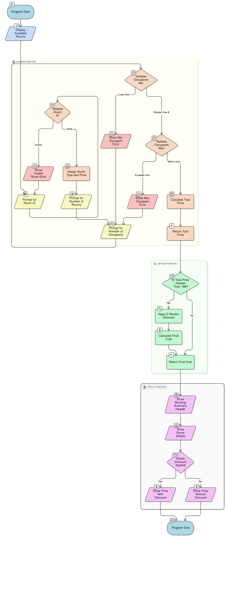

# FUNDAMENTALS OF PROGRAMMING

## BSPT0024 - FINAL PROJECT REPORT

### SEMESTER II SESSION 2024/2025

---

**Course Name:** Fundamentals of Programming  
**Course Code:** BSPT0024  
**Section:** C1S1  
**Project Title:** Hotel Room Booking System

### Group Members:

- **Malek** - Section C1S1
- **Mohammed** - Section C1S1
- **Mojtaba Ahmed** - Section C1S1
- **Yousif** - Section C1S1
- **Zeyad** - Section C1S1

---

## Study Case Question

You're looking for any available room for the holiday next month. Below are some of the hotel rooms available and their prices:

| Room Type   | Room ID | Price (RM) | Maximum Occupants |
| ----------- | ------- | ---------- | ----------------- |
| Single Room | 1       | RM 50      | 1                 |
| Double Room | 2       | RM 90      | 2                 |
| Deluxe Room | 3       | RM 150     | 4                 |
| Suite       | 4       | RM 250     | 6                 |

### Requirements:

- Create room details using an array and show available rooms and prices to users
- Function `calcFee()` receives number of customers, booked rooms, and price per room to calculate total cost
- Function `getDisc()` receives total cost and calculates final cost after discount (5% if total > RM 180)
- Function `main()` prompts for room ID, quantity, and occupants with proper validation
- Print a formatted receipt with booking summary

<br>
<br>
<br>
<br>

---

## Member Task Distribution

| Member       | Section | Task                                 | Signature                  |
| ------------ | ------- | ------------------------------------ | -------------------------- |
| **Malek**    | C1S1    | Program Design & Logic               | **\*\*\*\***\_**\*\*\*\*** |
| **Mohammed** | C1S1    | Function Implementation              | **\*\*\*\***\_**\*\*\*\*** |
| **Mojtaba**  | C1S1    | Flowchart & Report Documenting       | **\*\*\*\***\_**\*\*\*\*** |
| **Yousif**   | C1S1    | Testing & Debugging                  | **\*\*\*\***\_**\*\*\*\*** |
| **Zeyad**    | C1S1    | Code Integration & Output Formatting | **\*\*\*\***\_**\*\*\*\*** |

---

<br>
<br>
<br>
<br>
<br>
<br>
<br>
<br>
<br>
<br>
<br>
<br>

## System Flowchart

## 

---

<br>
<br>
<br>
<br>

## Source Code

```cpp
#include <iostream>
#include<iomanip>
using namespace std;
// global variable
float total_be,discount, room_price,final_cost;
int id,book_rooms,occupant;
string room;


//the declaration of the function;
float CalcFee(){
	//user input(id)
	room_num:
	cout<<"enter the room id you want to Book: ";
	cin>>id;
	// cout<<endl;

	//Validate room number;
	switch(id){
		case 0:
		room="single room";
		room_price=50;
		break;

		case 1:
		room="Double room";
		room_price=90;
		break;

		case 2:
		room="Deluxe room";
		room_price=150;
		break;

		case 3:
		room="suite";
		room_price=250;
		break;

		default:
		cout<<"Invalid room id"<<endl;
		goto room_num;
	}


	cout<<"enter the quantity of rooms to book: ";
	cin>>book_rooms; 	//user input(quantity)
	cout<<endl;

	int max_occupants[] = {1, 2, 4, 6}; 	// Define max occupants for each room type

	label:
	cout<<"enter the number of occupants: ";
	cin>>occupant; 		//user input (occupant)
	cout<<endl<<endl<<endl;

	if(occupant<1){
		cout<<"Occupant cant be less than 1"<<endl;
		goto label;
	}

	// Check if occupants exceed max allowed for the selected room
	if (id >= 0 && id < 4 && occupant > max_occupants[id]) {
		cout << "Number of occupants exceeds the maximum allowed for this room type (" << max_occupants[id] << "). Please enter a valid number." << endl;
		goto label;
	}

	total_be=book_rooms*room_price; 	//total price befor discount
	return total_be;
}

//declaration of the function
float getDisc(){
	//the condition
	if (total_be>180){
		discount=total_be*0.05; 		//the discount
		final_cost=	total_be-discount; 	//the final cost of the rooms;
	}
	return final_cost;
}

void display(string room, int book_rooms, float total_be, float final_cost, int occupant, int id){
	cout<<"==================== Booking Summery====================="<<endl;
	cout<<"Room Type: "<<room<<endl;
	cout<<"Number of Rooms Booked: "<<book_rooms<<endl;
	cout<<"Number of Occupants: "<<occupant<<endl;
	if(total_be>180){ //condition of price more than 180;
		cout<<"Total price (befor Discount): RM "<<fixed<<setprecision(2)<<total_be<<endl;
		cout<<"Discount Amount (5%): RM "<<discount<<endl;
		cout<<"Total price (after discount): RM "<<final_cost<<endl;
    }else{
     	cout<<"Total price: RM "<<fixed<<setprecision(2)<<total_be<<endl;
	}
}


int main(){

	string names[]={"single room","Double Room","Deluxe Room","Suite"}; //Basically all of this for just to make the user see our Available Rooms;

	string prices[]={"50.00","90.00","150.00","     250.00"};

	string max_occupants[]={"1","2","4","6"};

	cout<<setw(67)<<"WELCOME TO OUR HOTEL "<<"\n"<<endl; 	//welcome massage;


	cout<<"Available Rooms:"<<endl;
	cout<<"\n"<<"Room id"<<setw(13)<<"Room type"<<setw(28)<<"price per Room(RM)"<<setw(25)<<"Max occupants"<<"\n"<<endl;
	cout<<"-----------------------------------------------------------------------------------"<<endl;

	for(int p=0;p<4;p++){
		cout<<p<<setw(21)<<names[p]<<setw(22)<<prices[p]<<setw(23)<<max_occupants[p]<<"\n"<<endl;
	}

	cout<<"\n"<<"\n"<<endl;
	//calling the function
	float total_cost = CalcFee();
	float final_cost = getDisc();

	display(room, book_rooms, total_cost, final_cost, occupant, id); //calling the function display

    return 0;

}
```

<br>
<br>
<br>
<br>
<br>
<br>
<br>
<br>
<br>
<br>
<br>
<br>
<br>
<br>

---

## Program Output Examples

### Sample Output 1 (With Discount):

```
                                              WELCOME TO OUR HOTEL

Available Rooms:

Room id    Room type          price per Room(RM)            Max occupants

-----------------------------------------------------------------------------------
0          single room                 50.00                      1

1          Double Room                 90.00                      2

2          Deluxe Room                150.00                      4

3                Suite                250.00                      6


enter the room id you want to Book: 2
enter the quantity of rooms to book: 2

enter the number of occupants: 8


==================== Booking Summery=====================
Room Type: Deluxe room
Number of Rooms Booked: 2
Number of Occupants: 8
Total price (before Discount): RM 300.00
Discount Amount (5%): RM 15.00
Final cost (after discount): RM 285.00
Thank you for choosing our hotel!
```

<br>
<br>
<br>
<br>
<br>
<br>
<br>
<br>
<br>
<br>
<br>
<br>

### Sample Output 2 (No Discount):

```
                                              WELCOME TO OUR HOTEL

Available Rooms:

Room id    Room type          price per Room(RM)            Max occupants

-----------------------------------------------------------------------------------
0          single room                 50.00                      1

1          Double Room                 90.00                      2

2          Deluxe Room                150.00                      4

3                Suite                250.00                      6


enter the room id you want to Book: 1
enter the quantity of rooms to book: 1

enter the number of occupants: 2


==================== Booking Summery=====================
Room Type: Double room
Number of Rooms Booked: 1
Number of Occupants: 2
Total price: RM 90.00
Thank you for choosing our hotel!
```

<br>
<br>
<br>
<br>
<br>
<br>
<br>
<br>
<br>
<br>
<br>
<br>
<br>
<br>

### Sample Output 3 (Error Handling):

```
                                              WELCOME TO OUR HOTEL

Available Rooms:

Room id    Room type          price per Room(RM)            Max occupants

-----------------------------------------------------------------------------------
0          single room                 50.00                      1

1          Double Room                 90.00                      2

2          Deluxe Room                150.00                      4

3                Suite                250.00                      6


enter the room id you want to Book: 1
enter the quantity of rooms to book: 1

enter the number of occupants: 3


Number of occupants exceeds the maximum allowed for this room type (2). Please enter a valid number.
enter the number of occupants: 4


Number of occupants exceeds the maximum allowed for this room type (2). Please enter a valid number.
enter the number of occupants: 2


==================== Booking Summery=====================
Room Type: Double room
Number of Rooms Booked: 1
Number of Occupants: 2
Total price: RM 90.00
Thank you for choosing our hotel!
```

---

## Conclusion

### What was accomplished:

1. **Successfully developed a comprehensive Hotel Room Booking System in C++** that meets all project requirements
2. **Implemented robust input validation** to ensure data integrity and user-friendly error handling
3. **Created efficient functions** for fee calculation (`calcFee()`) and discount application (`getDisc()`)
4. **Designed a professional user interface** with proper formatting and clear booking summaries
5. **Utilized arrays effectively** to store and manage room information as specified in requirements

### What was learned:

1. **Advanced programming concepts** including structures, arrays, functions with parameters and return values
2. **Input validation techniques** and error handling to create robust applications
3. **Professional code formatting** and documentation practices for maintainable code
4. **Team collaboration skills** through effective task distribution and integration
5. **Problem-solving methodologies** for debugging and optimizing program logic

### Technical skills developed:

1. **Function design** with proper parameter passing and return value handling
2. **Data structure usage** with arrays and structures for organized data management
3. **Conditional logic implementation** for business rules (discounts, validation)
4. **Output formatting** using `iomanip` library for professional presentation
5. **Code organization** and modular programming principles

### Challenges faced and overcome:

1. **Input validation complexity** - Resolved by creating a dedicated validation function
2. **Data organization** - Implemented structure arrays for better data management
3. **Function parameter passing** - Ensured functions receive and return appropriate values
4. **Output formatting consistency** - Used `setw()` and `setprecision()` for aligned output
5. **Team coordination** - Established clear task division and regular code integration

---

## References

### Online Resources:

1. **Stack Overflow.** (2024). _C++ Programming Help and Best Practices_. Retrieved from https://stackoverflow.com/questions/tagged/c%2B%2B
2. **W3Schools.** (2024). _C++ Tutorial - Functions, Arrays, and Input/Output_. Retrieved from https://www.w3schools.com/cpp/
3. **GeeksforGeeks.** (2024). _C++ Input Validation and Error Handling_. Retrieved from https://www.geeksforgeeks.org/c-plus-plus/
4. **CPlusPlus.com.** (2024). _C++ Reference Documentation_. Retrieved from https://www.cplusplus.com/reference/

### Academic Resources:

1. **Course Textbook:** _Fundamentals of Programming Concepts_ - Chapter 7: Functions and Parameter Passing
2. **Course Textbook:** _Fundamentals of Programming Concepts_ - Chapter 8: Arrays and Data Structures
3. **Lecture Notes:** _Week 10-12: Advanced Function Usage and Data Organization_
4. **Lab Manual:** _BSPT0024 Programming Exercises - Input/Output Formatting_
